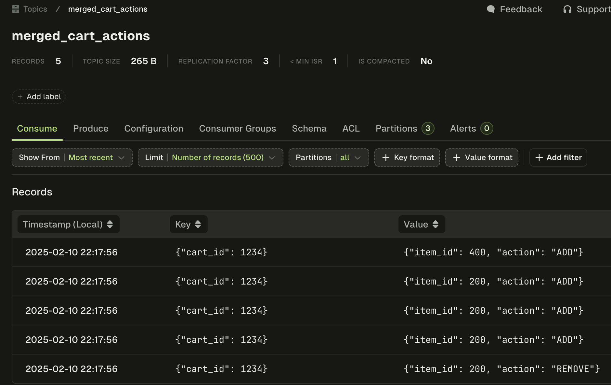
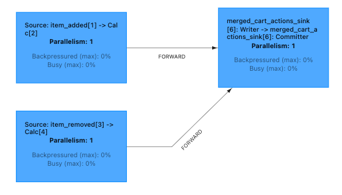
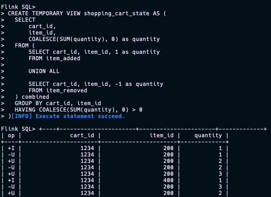
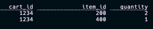

# stream-processing
A collection of examples and tips for getting started with stream processing using [Apache Kafka](https://kafka.apache.org/) & [Apache Flink](https://flink.apache.org/). This will be useful for those getting setup locally in no time and seeking an introduction to fundamental concepts with some worked examples.

The below section on Flink is to accompany [the Medium article](https://medium.com/@smould1011/query-kafka-using-flink-sql-hands-on-guide-377da793d675). 

- [Flink](#flink)
- [1. Practical tips for getting started with Flink](#1-practical-tips-for-getting-started-with-flink)
  - [Accessing the SQL Client](#accessing-the-sql-client)
  - [Kafka Tables](#kafka-tables)
  - [Inserting Values](#inserting-values)
  - [Running SQL scripts](#running-sql-scripts)
- [2. Examples working with data](#2-examples-working-with-data)
  - [A simple view](#a-simple-view)
  - [Example: Querying with order](#example-querying-with-order)
  - [Example: View for watching the (COUNT of) items added to cart](#example-view-for-watching-the-count-of-items-added-to-cart)
  - [Example: Enriching a stream from 3 source streams](#example-enriching-a-stream-from-3-source-streams)
  - [Example: Building state from deltas](#example-building-state-from-deltas)
- [Conclusion](#conclusion)
  - [Reference Data - What each of the data/ files are for](#reference-data---what-each-of-the-data-files-are-for)


# Flink
The below content details some guides & how-to's as well as references to stream processing concepts including:
1. Practical tips for getting started with Flink, including using this local dev stack to familiarise yourself
1. Examples performing typical stream processing operations and working with the data.
   1. Inspired by the ksqlDB exercises from the great course by Confluent [Introduction to Designing Events and Event Streams](https://developer.confluent.io/courses/event-design/intro/). For further development I recommend following the course and recreating the exercises in Flink as I have done here, you can use my examples I've provided if you get stuck.

# 1. Practical tips for getting started with Flink

Run the getting started stack included in the `docker-compose.yaml` file to run a local Flink, Kafka and Kafka tooling([Conduktor](https://conduktor.io/)).

```bash
docker compose up -d
```

## Accessing the SQL Client
For running Flink SQL commands there is a sql-client service running from the docker-compose.

```bash
# Start running FLink SQL commands
docker compose exec -it sql-client bash -c "bin/sql-client.sh" # from the compose
```
I will expand later on [running SQL Scripts](#running-sql-scripts).

## Tables
Flink is centered around the concept of tables, they discuss this at length in the [Flink docs](https://nightlies.apache.org/flink/flink-docs-release-1.20/docs/concepts/overview/). In our case we're going to use dynamic tables specifically, note Flink has support for batch workloads too. The dynamic tables we'll use represent the data within the underlying Kafka topics. This concept of stream table duality comes up frequently, where the data is being looked at as a stream, or a table. Let's get started.

Topics should be created before tables. This is closer to real-world behavior where the creation of topics is usually governed and splits the infrastructure management concern from the processing logic.

Create the topic items in the UI that is running locally on [localhost:8080](http://localhost:8080), you'll need to create a local user to start. Alternatively use the CLI:

```bash
docker compose exec kafka1 /bin/kafka-topics --create --topic items --bootstrap-server kafka1:9092,kafka2:9092,kafka3:9092 --partitions 3 --replication-factor 2

```

Running the below SQL in the SQL client, **create a dynamic table** with:
```sql
--DDL for Flink dynmaic table
CREATE TABLE items(
  id BIGINT,
  price DECIMAL(10, 2),
  name STRING,
  description STRING,
  brand_id BIGINT,
  tax_status_id BIGINT,
  proc_time AS PROCTIME()
) WITH (
  'topic' = 'items',
  'key.fields' = 'id',
  'properties.group.id' = 'flink_table_items', -- CG name needed for Kafka
  'connector' = 'kafka',
  'properties.bootstrap.servers' = 'kafka1:9092',
  'format' = 'avro-confluent',
  'avro-confluent.url' = 'http://schema-registry:8081',
  'key.format' = 'avro-confluent',
  'key.avro-confluent.url' = 'http://schema-registry:8081',
  'value.format' = 'avro-confluent',
  'value.fields-include' = 'EXCEPT_KEY', -- set on key.fields property above, exclude the key in the value
  'properties.auto.offset.reset' = 'earliest' -- needed for Kafka
--   'scan.startup.mode' = 'earliest-offset'
--   'properties.security.protocol' = 'PLAINTEXT',
--   'properties.sasl.mechanism' = 'PLAINTEXT', 
--   'properties.sasl.jaas.config' = 'org.apache.kafka.common.security.plain.PlainLoginModule required username="" password="";',
--   'value.format' = 'json', -- alternative for just JSON
--   'sink.partitioner' = 'fixed' -- Fixed will send to same partition, for demo purposes only
);
```
These properties are specific to this `connector` type, I've also left some commented out to show what else you may consider in a non-dev environment. The [Flink docs](https://nightlies.apache.org/flink/flink-docs-master/docs/connectors/table/formats/avro-confluent/) were particularly useful for schema registry properties. Table properties can also be updated later on.

`ALTER TABLE items SET ('properties.group.id'='flink_table_items');`

Some useful commands for interrogating tables in Flink were: `SHOW tables;` , `DESCRIBE items;` and `SHOW CREATE TABLE items;` for more info. Note lowercase works. The full properties list for altering tables is, you guessed it, on the [Flink docs](https://nightlies.apache.org/flink/flink-table-store-docs-release-0.3/docs/how-to/altering-tables/).

When building your processing queries you have to explicitly say which timestamps may be processing time, this can be added with:
```sql
ALTER TABLE items ADD proc_time AS PROCTIME();
```

## Inserting Values
Insert values with SQL statements.
```sql
INSERT INTO items
VALUES (
    1,                                             
    CAST(19.99 AS DECIMAL(10, 2)),                
    'Baseball Trading Cards - Collector Edition',  
    'Premium Ol Slugger baseball trading cards!',  
    401,                                           
    778                                           
);
```
Appears on the topic.

Note if this fails on the Kafka side the message is lost, as the INSERT job completed, but Kafka failed, to have retries you need to insert from a streaming table rather than fire and forget one valid command. 

You can see the issue for failed jobs in the job manager log list by searching for `FAILED`, or specifically the job exception list as it throws an exception, it's a nice jump to the failure. Note this doesn't throw an **error** as it fails gracefully. Example I had was forgetting to make the topic beforehand.
Examples of streaming tables which will retry:

```sql
-- One-time but with retries
INSERT INTO items
SELECT * FROM source_items -- populated table
WHERE id = 1;  -- Or any specific condition
```

You can also source items being from a filesystem table. Note this will include the header, I believe there are functions in the Java, Scala and Python libraries to ignore but not in the [connector config](https://nightlies.apache.org/flink/flink-docs-release-1.16/docs/connectors/table/formats/csv/).

```sql
-- with the Kafka table already created (items in this example) 

-- create source filesystem table
CREATE TABLE items_from_file (
  id BIGINT,
  price DECIMAL(10, 2),
  name STRING,
  description STRING,
  brand_id BIGINT,
  tax_status_id BIGINT
) WITH (
  'connector' = 'filesystem',
  'path' = '/opt/flink/data/items_data.csv', -- local csv
  'format' = 'csv',
  'csv.ignore-parse-errors' = 'true',
  'csv.allow-comments' = 'true'
);

-- stream from source to the topic table
INSERT INTO items
SELECT *
  FROM items_from_file;
```

Additionally the data-gen connector is particularly useful when you want a table with data in it.
```sql
CREATE TABLE `pageviews` (
  `url` STRING,
  `user_id` STRING,
  `browser` STRING,
  `ts` TIMESTAMP(3)
)
WITH (
  'connector' = 'faker',
  'rows-per-second' = '10', -- can edit with, ALTER TABLE `pageviews` SET ('rows-per-second' = '10');
  'fields.url.expression' = '/#{GreekPhilosopher.name}.html',
  'fields.user_id.expression' = '#{numerify ''user_##''}',
  'fields.browser.expression' = '#{Options.option ''chrome'', ''firefox'', ''safari'')}',
  'fields.ts.expression' =  '#{date.past ''5'',''1'',''SECONDS''}'
);
```


## Running SQL scripts
You're likely to want to make things more repeatable, more scriptable or make a mistake/encounter an error and need to look back at commands. Running SQL scripts is useful here.  
**Note tables are kept in memory** unless persisted, all tables, views etc. are lost when the session ends. As a result you'll want to start your SQL script with table creations. In production you'd use a permanent catalog like Hive.
[Flink doc examples](https://nightlies.apache.org/flink/flink-docs-release-1.13/docs/dev/table/sqlclient/#initialize-session-using-sql-files).

The below is how I found copying scripts into the container and running them to work nicely, change the environment variable `SQL_HOST`, to match your path as needed. I used `add-records.sql` to add any new records to a table.
```bash
docker compose exec sql-client bash -c "mkdir -p /opt/flink/opt/scripts/"
SQL_HOST=./confluent-course-examples-and-data/data/add-records.sql
SQL_CONTAINER=/opt/flink/opt/scripts/add-records.sql
docker cp $SQL_HOST sql-client:$SQL_CONTAINER
docker compose exec sql-client /opt/flink/bin/sql-client.sh -f $SQL_CONTAINER
```
# 2. Examples working with data

## A simple view
The `view-all-items.sql` script is for more than just adding data to the Kafka table (and hence underlying topic). It's a bit more useful:
* Create table for all_items
* Create a view from the table
* Set execution mode as this is non-interactive mode.
  * *As we're running in a script, non-interactive mode, you need to explicitly set the result mode. This isn't required when working in the SQL client (SQL terminal) directly as it sets it's own mode there*
* Views the view

Use the block above on [running SQL scripts](#running-sql-scripts) to run the script.  
Note this is blank if there's no data on the topic as there's nothing to view. Try [inserting values](#inserting-values).

## Example: Querying with order
Note in the current examples they don't have any **time attribute** fields (different from timestamps, special watermark based), so have to use `proc_time` or windowing (`window_time`) when querying using **order**. 

Here I added `PROCTIME()` so I could use it to window, I don't have event time in these events.

This metadata column can be added to the table, or added in a view by including in the `SELECT`.

```sql
ALTER TABLE items ADD proc_time AS PROCTIME();
```

```sql
SELECT *
FROM TABLE(
    TUMBLE(
        TABLE items, 
        DESCRIPTOR(proc_time), 
        INTERVAL '10' MINUTES
    )
)
ORDER by window_time, price;
```
See [view-ordered-windowed.sql](./flink/confluent-course-examples-and-data/data/view-ordered-window.sql) for this with view created too.

## Example: View for watching the (COUNT of) items added to cart
In this example a topic exists sending item added to cart events. It contrasts to ksqlDB which was being used in the examples on the course.
The config is for the local stack you can spin-up here, just create the topic.

Make a table for the topic `item_added`.

```sql
-- ksqlDB syntax
CREATE STREAM item_added (
  cart_id BIGINT key,
  item_id BIGINT
) WITH (
  KAFKA_TOPIC = 'item_added',
  VALUE_FORMAT = 'AVRO',
  PARTITIONS = 6
);

-- flink translation
CREATE TABLE item_added (
  cart_id BIGINT,
  item_id BIGINT,
  proc_time AS PROCTIME()
) WITH (
  'connector' = 'kafka',
  'topic' = 'item_added',
  'properties.bootstrap.servers' = 'kafka1:9092',
  'format' = 'avro-confluent',
  'avro-confluent.url' = 'http://schema-registry:8081',
  'key.format' = 'avro-confluent',
  'key.fields' = 'cart_id',
  'key.avro-confluent.url' = 'http://schema-registry:8081',
  'value.format' = 'avro-confluent',
  'value.fields-include' = 'EXCEPT_KEY',
  'properties.group.id' = 'flink_table_item_added', -- CG name needed for Kafka
  'properties.auto.offset.reset' = 'earliest' -- needed for Kafka
);

-- Now watch the item count per cart 
CREATE VIEW items_per_cart AS
SELECT cart_id, COUNT(*) as items_in_cart
  FROM TABLE(
    TUMBLE(
        TABLE item_added, 
        DESCRIPTOR(proc_time), 
        INTERVAL '5' SECONDS
    )
)
GROUP BY cart_id;

SELECT * FROM items_per_cart;
```
Add [items to cart](./flink/confluent-course-examples-and-data/data/add-items-to-cart.sql) and watch the increase from the events. I did this with two sql-clients open, the view on one screen and added one by one on the other. *Remember you need to create the table in the new client as tables are stored in memory here.*

## Example: Enriching a stream from 3 source streams

Rather than have all the item data in the items topic as we have done, what if the data had needed combining to get here. Let's combine three different streams to make our enriched stream.

You'll likely want to run the scripts provided. Swapping out the script in the below command. They're fairly simple creating the tables, inserting data, then finally the interesting part of making the joined view. Note uncommenting the `INSERT INTO` is what will populate the topic if you want to more than just view it.

```bash
docker compose exec sql-client bash -c "mkdir -p /opt/flink/opt/scripts/"
SQL_HOST=./confluent-course-examples-and-data/data/enriching-streams/add-split-stream-data.sql
SQL_CONTAINER=/opt/flink/opt/scripts/target-script.sql
docker cp $SQL_HOST sql-client:$SQL_CONTAINER
docker compose exec sql-client /opt/flink/bin/sql-client.sh -f $SQL_CONTAINER
```
1. Create the four topics needed on Kafka. Which are the three additional source topics and a sink topic for enriched stream [brands, tax_status, unenriched_items, enriched_items]. Use your preferred method or the Conduktor UI running on [localhost:8080](http:localhost:8080) if you're running the stack
1. Populate the brand, tax_status and unenriched_items topics with [add-split-stream-data.sql](./flink/confluent-course-examples-and-data/data/enriching-streams/add-split-stream-data.sql)
1.  Then run [enriched-stream-setup.sql](.flink/confluent-course-examples-and-data/data/enriching-streams/enriched-stream-setup.sql) to view the joined table in Flink

Adding more messages to the topics would cause the view to update. What is more useful perhaps is writing to the topic using `INSERT INTO`. We can then view from the new topic instead.

Note the final view statement has the joins, with a 2 minute (+/-1) for the temporal join so will be waiting to update as we update any values on the join.

```sql
...
FROM unenriched_items
    JOIN brands 
        ON unenriched_items.brand_id = brands.id
        AND unenriched_items.proc_time BETWEEN brands.proc_time - INTERVAL '1' MINUTE 
        AND brands.proc_time + INTERVAL '1' MINUTE
...
;
```
Note if you run the script multiple times you may end up requesting that job multiple times and run out of resources.

Stop any duplicate jobs with:

```sql
SHOW JOBS;  -- to see all running jobs and their IDs
STOP JOB '<job_id>';  -- to stop a specific job, ID enclosed in quotes
```
The job ID can be inspected using Flink Job Manager UI running on [localhost:8081](http://localhost:8081).

## Example: Building state from deltas
Example of multi-event streams. Will build a shopping cart state from deltas of adding or removing items from cart, i.e. if I add two of an item, and remove one of the item the cart state is one item.

We'll
1. Create item added stream
1. Create item removed stream
1. Add records to the streams
1. Setup a continuous job to merge the streams and enrich with if the item was added, or removed
1. Create a view to see the live result

Creating the item added stream - create the topics `item_added`, `item_removed`, `merged_cart_actions`.
Create the tables and insert mock data using [add-remove-items-cart.sql](./flink/confluent-course-examples-and-data/data/building-state-from-deltas/add-remove-items-cart.sql).

```bash
docker compose exec sql-client bash -c "mkdir -p /opt/flink/opt/scripts/"
SQL_HOST=./confluent-course-examples-and-data/data/building-state-from-deltas/add-remove-items-cart.sql
SQL_CONTAINER=/opt/flink/opt/scripts/target.sql
docker cp $SQL_HOST sql-client:$SQL_CONTAINER
docker compose exec sql-client /opt/flink/bin/sql-client.sh -f $SQL_CONTAINER
```

With data in the two source topics, let's setup a continuous job to merge the streams by getting all records from each source topic, and conditionally enriching them with `ADD` or `REMOVE` depending on which topic they came from.
[merged-cart.sql](./flink/confluent-course-examples-and-data/data/building-state-from-deltas/merged-cart.sql).
You should see the enriched messages from both source topics on the merged topic such as in the below screenshot from [Conduktor](https://conduktor.io)



You can also see this running Flink job visually in the Flink Job Manager UI running on [localhost:8081](http://localhost:8081).



Lastly let's see this live state of the cart. 

If you run the script in one go using the method described so far, you will get the changelog view.  
This is because we can't use the default SQL client *interactive mode*, you'll get an error telling you as such, instead use the table style `TABLEAU` when running a script, this shows the change like in CDC rather than the end result.



To get the final result nicely displayed you can start a sql client in your terminal (`docker compose exec -it sql-client bash -c "bin/sql-client.sh"`). Then sequentially paste and run each of the queries in [shopping-cart-state.sql](./flink/confluent-course-examples-and-data/data/building-state-from-deltas/shopping-cart-state.sql).



# Conclusion
We've gone through some practical tips of getting started working with Flink locally, running SQL queries on Kafka and some more advanced examples of stream processing.  
Hopefully this gives you an overview of some typical stream processing operations and how you can explore this for yourself, thanks for reading.


## Reference Data - What each of the data/ files are for
Ordered by when mentioned in this doc, or otherwise used.
`view-all-items.sql` - Creates a table for all_items, this is shopping cart items used in the exercises.  
`add-records.sql` - Example to Add more records to a table.  
`view-ordered-window.sql` - Example of view with `ORDER BY`.  
`add-items-to-cart.sql` - Adding items to cart event used in worked example.  

`add-split-stream-data.sql` - Add split data to source topics for joining.  
`enriched-stream-setup.sql` - Create a view enriching source topic data by joining on other topics.  

`add-remove-items-cart.sql` - Add mock data to topics in prep of joining them.  
`merged-cart.sql` - Job. Enrich messages from topics, based on which topic they are from as added or removed, send to destination topic.  
`shopping-cart-state.sql` - Create the joined view from the joined topic's deltas on source topic.  

### event-processing/
`streaming-analytics-event-time.sql` - Examples using event time.
`streaming-analytics-proc-time.sql` - Different examples of how you can build a COUNT using processing time.
